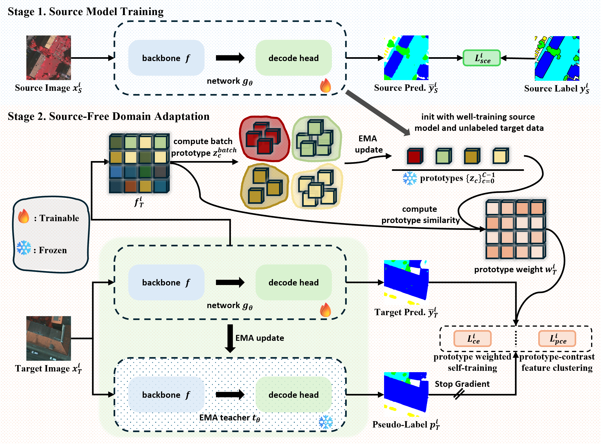

<h2 style="border-bottom: 1px solid lightgray;">Prototype-Based Pseudo-Label Denoising for Source-Free Domain Adaptation in Remote Sensing Semantic Segmentation</h2>

  <a href="#">
   
    
    
    
    
    
     
    
    
    
    

  

 

[//]: # ()

[//]: # (
 Prediction results of our proposed method. 
)

[//]: # ( )

[//]: # ( )

[//]: # (
)

[//]: # (    )

[//]: # ()

[//]: # (
)

[//]: # (
 Network Architectural and Cross-domain Image Different. 
)

---
[//]: # (- [2024/09/26]  Our paper is accepted to **NeurIPS 2024**.)

[//]: # (- [2024/09/25] ✨✨ We have updated the [arxiv]&#40;https://arxiv.org/abs/2403.07721&#41; paper.)

[//]: # (- [2024/08/01] Update scripts for training and inference in different tasks.)

[//]: # (- [2024/05/19] Update the dataset loading scripts.)

[//]: # (- [2024/11/28] ✨✨This work was submitted  to **IEEE TMM**.)
[//]: # (- [2024/10/17] ✨✨The [arxiv]&#40;https://arxiv.org/abs/2410.13471&#41; paper is available.)
- [2024/9/16] ✨✨The [arxiv] paper will coming soon。
- [2025/9/15] 🔥🔥 This work was submitted.

## The code in coming soon 🤗🤗
